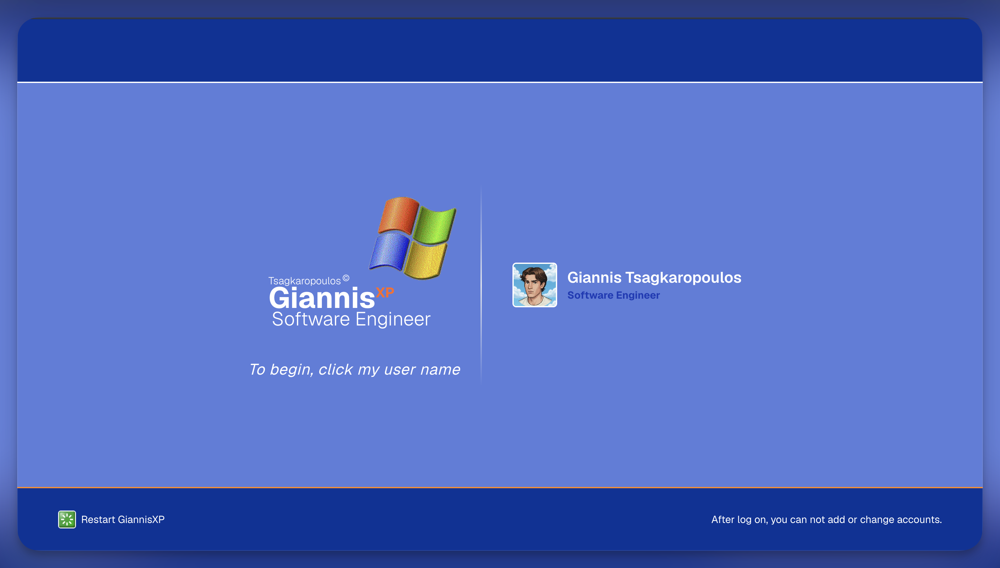
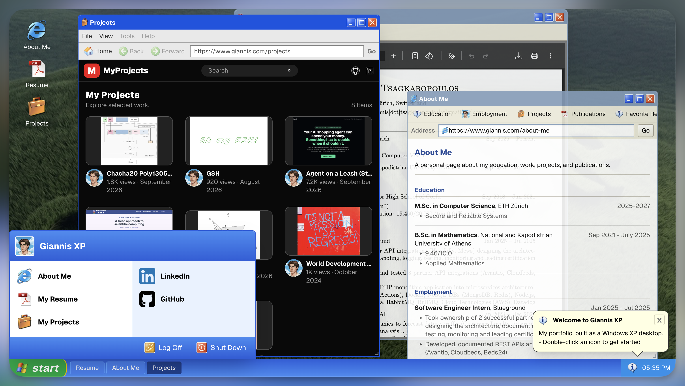

# GiannisXP

> Work in progress

My portfolio as a working Windows XP desktop in the browser. Boot the machine, log in and move through a "window manager" with a Start menu, taskbar and windows-XP-inspired windows. Portfolio pages and interactive apps open like programs.

<p float="left">
  
  
</p>


## Running locally

This project uses [Next.js](https://nextjs.org/) and requires a recent version of Node.js.

```bash
npm install
npm run dev
```

## Project structure

The main experience starts in `app/page.tsx`. It switches between the boot sequence screens and renders `components/desktop/Desktop` once the user has logged in. The desktop then launches the portfolio applications in `components/apps`. All the data are static and hardcoded in `data/` and `public/`.

## Credits

- The Windows XP-inspired presentation and interaction model were influenced stongly by [Mitchivin XP](https://github.com/mitchivin/MitchIvin-XP).
- Windows-XP Icons: [marchmountain](https://www.deviantart.com/marchmountain)

## Disclaimer

This project has no affiliation with Microsoft. Any real names that appear in comments within the project-details work are purely fictional.